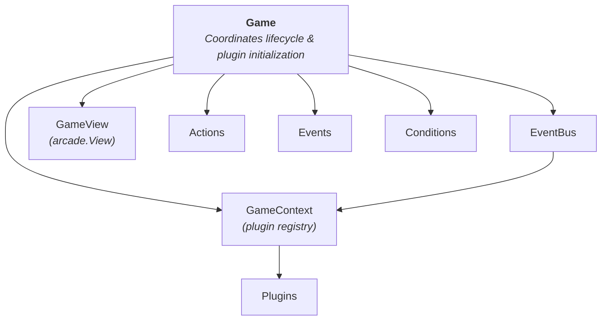

# API Reference

Complete reference for the Pedre framework's Python API.

## Overview

The Pedre framework is built on several core architectural components that work together to provide a flexible, event-driven RPG engine. This reference covers the framework's public API for Python developers.

## Architecture



## Core Components

### [Game](game.md)

Central coordinator for game lifecycle and plugin initialization.

**Responsibilities:**

- Initialize plugins in correct order (Actions → Events → Conditions → Plugins)
- Manage GameView lifecycle (new game, continue, load, exit)
- Coordinate save/load operations
- Own long-lived objects (EventBus, GameContext, PluginLoader)

**Key Methods:**

- `start_new_game()`, `start_game_or_load()`, `continue_game()`
- `load_game()`, `exit_game()`
- `show_game()`

### [Views](views.md)

Primary game screen.

**GameView:**

- `GameView` - Main gameplay with all plugins active
- Managed by the Game coordinator

### [GameContext](game-context.md)

Central registry providing plugins with access to the event bus and other plugins.

**Responsibilities:**

- Plugin registration and retrieval
- Event bus access
- Dependency injection

**Key Methods:**

- `get_plugin(name: str) -> BasePlugin | None`

### [EventBus](event-bus.md)

Publish-subscribe event system for decoupled communication.

**Responsibilities:**

- Event subscription and publishing
- Plugin-to-plugin communication
- Script trigger handling

**Key Methods:**

- `subscribe(event_type, callback)`
- `publish(event)`
- `unsubscribe(event_type, callback)`

### [PluginLoader](plugin-loader.md)

Handles dynamic loading, dependency resolution, and lifecycle management for all plugins.

**Responsibilities:**

- Instantiate plugins in dependency order (topological sort)
- Detect circular dependencies
- Manage plugin lifecycle (setup, reset, cleanup)

### [Sprites](sprites.md)

Animated character sprites for player and NPCs.

**Available Sprites:**

- `AnimatedPlayer` - Player character with 4-directional animation
- `AnimatedNPC` - NPC characters with special animations

## Game Plugins

Pedre uses a plugin-based architecture where each plugin handles specific functionality. All plugins are documented in the [Plugins Reference](../plugins/index.md).

**Core Plugins:**

- [DialogPlugin](../plugins/dialog.md) - Conversations and text display
- [NPCPlugin](../plugins/npc.md) - NPC behavior and interactions
- [PlayerPlugin](../plugins/player.md) - Player character management
- [ScriptPlugin](../plugins/script.md) - Event-driven scripting
- [InventoryPlugin](../plugins/inventory.md) - Item management
- [AudioPlugin](../plugins/audio.md) - Music and sound effects
- [CameraPlugin](../plugins/camera.md) - Camera control
- [ScenePlugin](../plugins/scene.md) - Map loading and transitions
- [SavePlugin](../plugins/save.md) - Game persistence

[See all plugins →](../plugins/index.md)

## Extension System

Pedre supports adding custom functionality without modifying framework code. See [Extending Pedre](../extending/index.md) for details.

**Extension Points:**

- Custom Actions - Script commands
- Custom Events - Trigger types
- Custom Conditions - Conditional logic
- Custom Plugins - Complete game features

## Usage Patterns

### Accessing Plugins

Plugins are accessed through the GameContext:

```python
# In a plugin or action
dialog_plugin = context.get_plugin("dialog")
npc_plugin = context.get_plugin("npc")
audio_plugin = context.get_plugin("audio")
```

### Publishing Events

Events enable decoupled communication:

```python
from pedre.events import DialogClosedEvent

# Publish an event
context.event_bus.publish(DialogClosedEvent(
    npc_name="merchant",
    dialog_level=1
))
```

### Subscribing to Events

Plugins can react to events:

```python
def on_dialog_closed(event: DialogClosedEvent):
    print(f"Dialog closed: {event.npc_name}")

context.event_bus.subscribe(DialogClosedEvent, on_dialog_closed)
```

### Game Lifecycle

Control game flow through the Game coordinator:

```python
# Start a new game
game.start_new_game()

# Continue existing game or load autosave
game.continue_game()

# Show game view
game.show_game()

# Load game from save data
game.load_game(save_data)
```

## Configuration

Game behavior is configured through `settings.py`. See [Configuration Guide](../guides/configuration.md) for all available settings.

**Common Settings:**

- Window size and title
- Player movement speed
- Plugin-specific configuration
- Asset paths

## Type System

Pedre uses Python type hints throughout. Key types:

```python
from typing import TYPE_CHECKING

if TYPE_CHECKING:
    from pedre.plugins.game_context import GameContext
    from pedre.events.base import EventBus
    from pedre.plugins.base import BasePlugin
```

## Initialization Flow

### 1. Game Startup

```python
from pedre import run_game

if __name__ == "__main__":
    run_game()
```

### 2. Plugin Loading

The framework automatically:

1. Loads configuration from `settings.py`
2. Creates arcade Window
3. Creates Game coordinator
4. Game creates EventBus and GameContext (long-lived objects)
5. Loads Actions, Events, and Conditions
6. Loads all plugins via PluginLoader
7. Sets up event subscriptions
8. Starts game directly (autoload or new game)

### 3. Game Loop

Each frame:

1. Process input
2. Update plugins (`update(delta_time)`)
3. Render views (`on_draw()`)
4. Handle events

## Best Practices

### Event-Driven Design

Prefer events over direct plugin calls:

```python
# Good: Event-driven
context.event_bus.publish(NPCInteractedEvent(npc_name="merchant"))

# Avoid: Direct coupling
npc_plugin.interact("merchant")
dialog_plugin.show_dialog("merchant", ["Hello!"])
```

### Plugin Dependencies

Access plugins through GameContext, not global imports:

```python
# Good: Via context
def execute(self, context):
    audio = context.get_plugin("audio")
    if audio:
        audio.play_sfx("sound.wav")

# Avoid: Direct import
from pedre.plugins.audio import AudioPlugin
audio = AudioPlugin()  # Creates duplicate instance
```

### Error Handling

Check for plugin availability:

```python
weather = context.get_plugin("weather")
if weather:
    weather.set_weather("rain")
else:
    # Weather plugin not installed
    pass
```

## Next Steps

- [Getting Started](../getting-started.md) - Build your first game
- [Plugins Reference](../plugins/index.md) - Individual plugin documentation
- [Scripting Guide](../scripting/index.md) - Event-driven scripting
- [Extending Pedre](../extending/index.md) - Add custom functionality
- [Tiled Integration](../guides/tiled-integration.md) - Level design workflow
